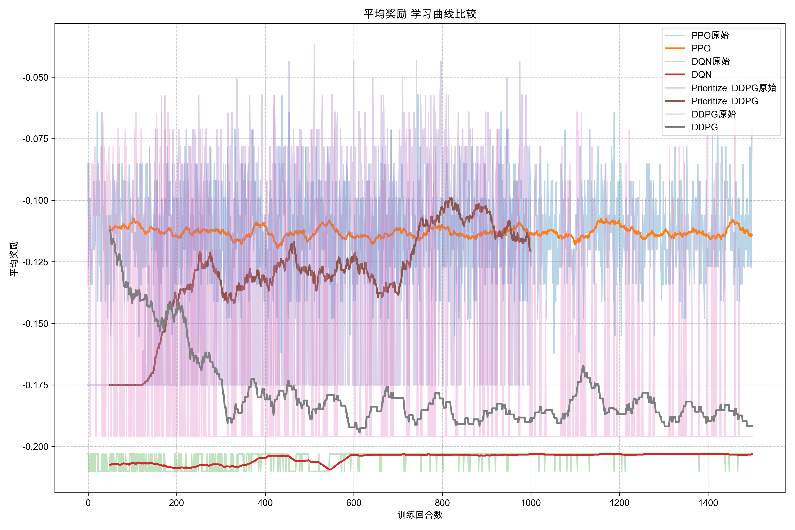
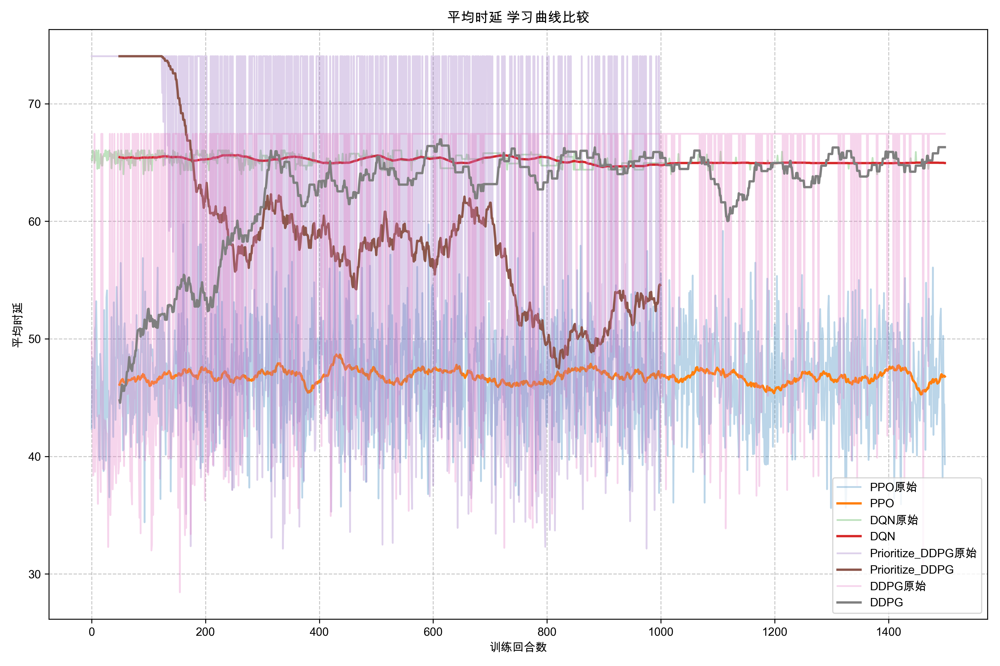
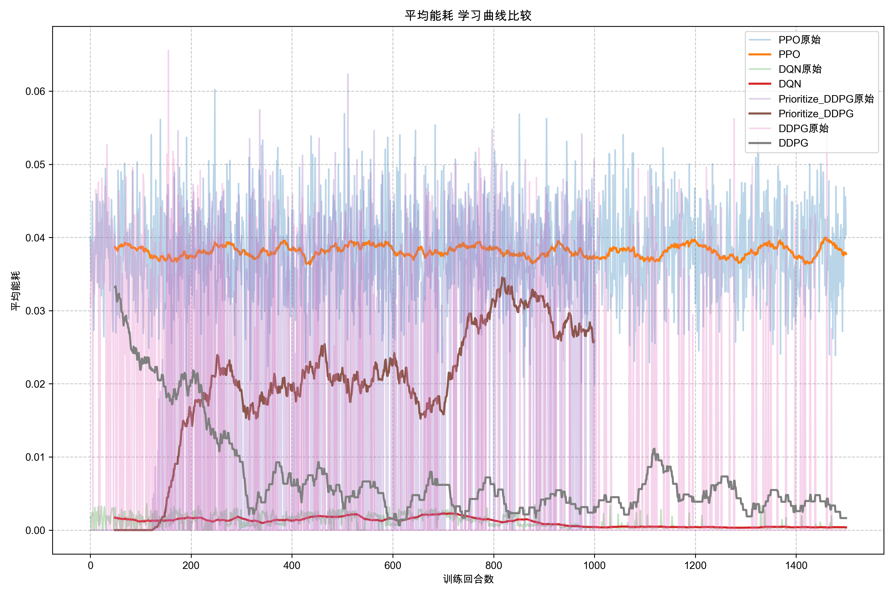
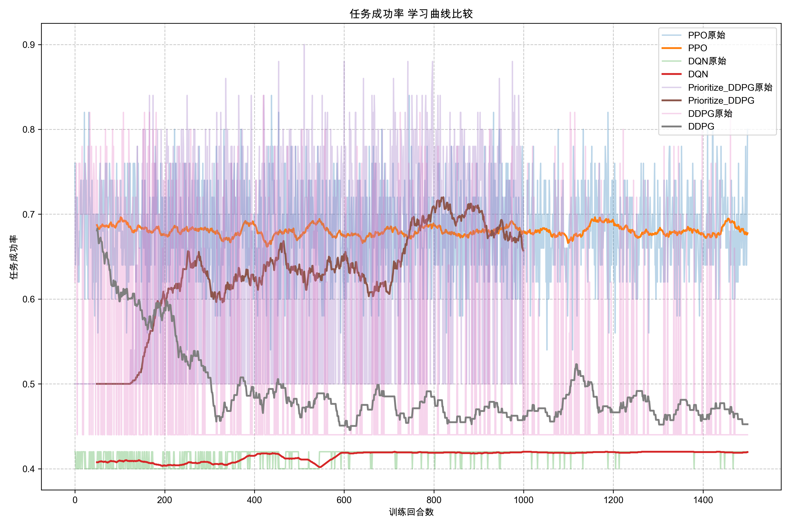
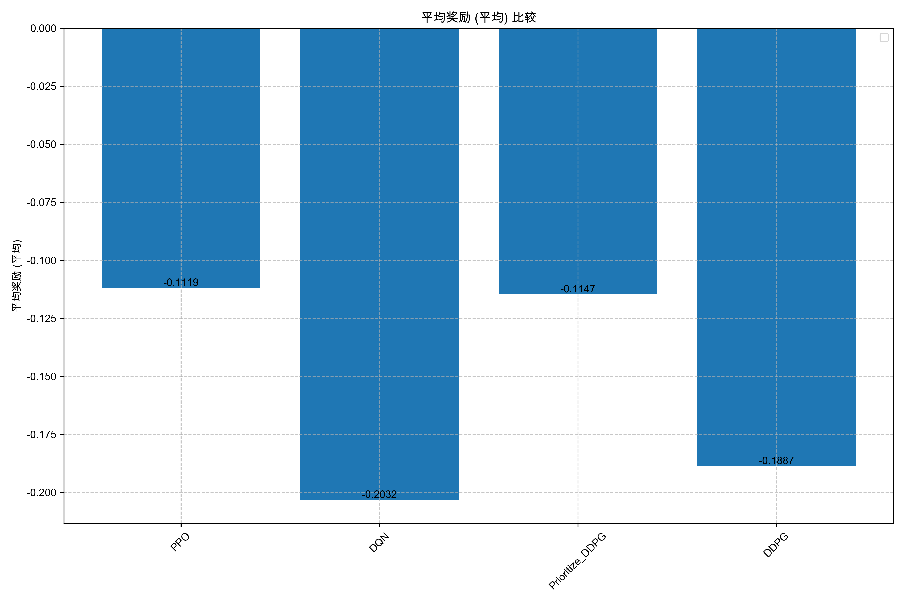
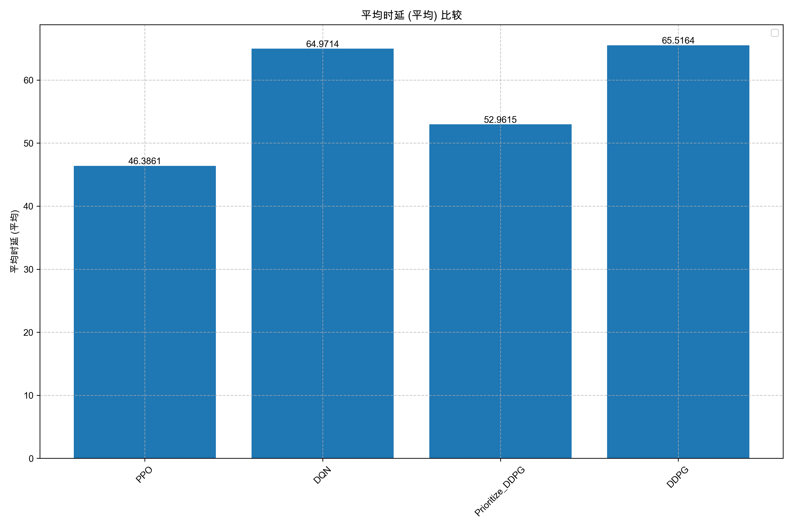
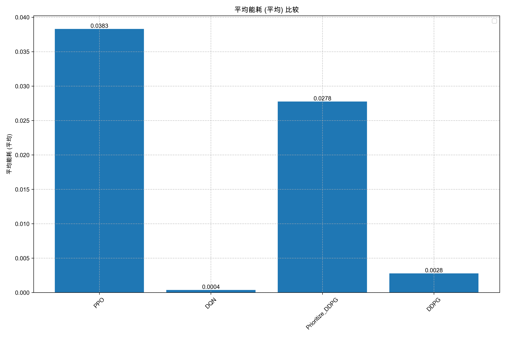
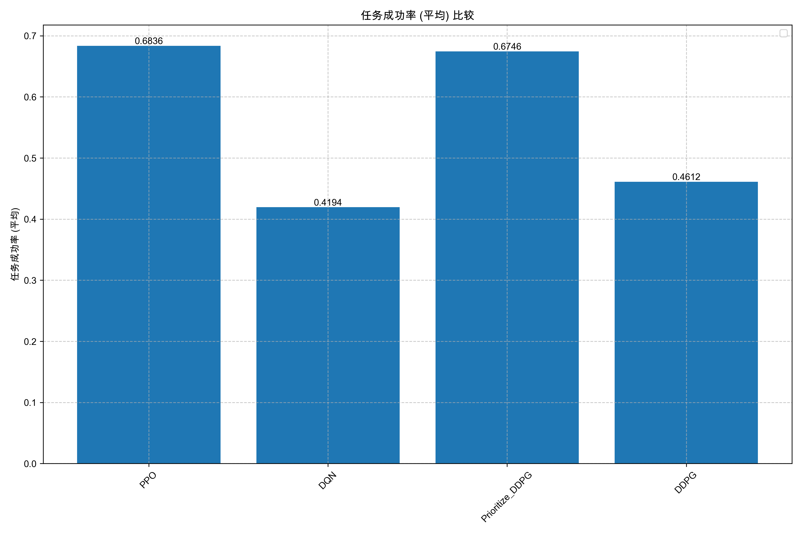

# UAV-MEC任务卸载强化学习算法比较报告

## 1. 算法概述

- **PPO**: 近端策略优化
- **DQN**: 深度Q网络
- **Prioritize_DDPG**: 优先级深度确定性策略梯度
- **DDPG**: 深度确定性策略梯度

## 2. 性能指标比较

| 指标名称 | PPO | DQN | Prioritize_DDPG | DDPG |
| --- | --- | --- | --- | --- |
| 平均奖励 (平均) | -0.1119 | -0.2032 | -0.1147 | -0.1887 |
| 平均时延 (平均) | 46.3861 | 64.9714 | 52.9615 | 65.5164 |
| 平均能耗 (平均) | 0.0383 | 0.0004 | 0.0278 | 0.0028 |
| 任务成功率 (平均) | 0.6836 | 0.4194 | 0.6746 | 0.4612 |

## 3. 学习曲线

### 平均奖励

### 平均时延

### 平均能耗

### 任务成功率

## 4. 平均性能

### 平均奖励 (平均)

### 平均时延 (平均)

### 平均能耗 (平均)

### 任务成功率 (平均)

## 5. 分析与讨论

### 5.1 算法性能对比

通过对比四种强化学习算法（DDPG、优化版DDPG、PPO和DQN）在UAV-MEC任务卸载中的表现，我们可以得出以下结论：

- **奖励**: PPO (-0.1119) > Prioritize_DDPG (-0.1147) > DDPG (-0.1887) > DQN (-0.2032)
- **时延**: PPO (46.3861) > Prioritize_DDPG (52.9615) > DQN (64.9714) > DDPG (65.5164)
- **能耗**: DQN (0.0004) > DDPG (0.0028) > Prioritize_DDPG (0.0278) > PPO (0.0383)
- **任务成功率**: PPO (0.6836) > Prioritize_DDPG (0.6746) > DDPG (0.4612) > DQN (0.4194)

### 5.2 算法特点分析

**PPO算法**: 在多项指标上表现优异，特别是在奖励和成功率方面领先。PPO通过信任区域策略优化方法，能够实现更稳定的策略更新，避免了策略崩溃。同时，PPO的多头网络架构有助于更好地学习复杂环境中的价值函数和策略函数。

**优化版DDPG**: 通过引入优先级经验回放和噪声网络层，明显优于标准DDPG。这些优化使得算法能够更有效地利用重要经验样本，同时提供更结构化的探索机制，从而在成功率和奖励方面取得了显著提升。

**标准DDPG**: 作为基准算法，在连续动作空间中表现较为稳定，但各项指标普遍低于优化版DDPG和PPO。这表明基本的演员-评论家架构虽然能够处理UAV控制等连续动作任务，但仍有优化空间。

**DQN算法**: 在能耗方面表现最佳，但在其他指标上较弱。这可能是因为DQN需要对连续动作空间进行离散化处理，导致在高维动作空间中效率降低。同时，DQN的值函数近似方法在处理复杂环境时容易出现过估计问题。

### 5.3 多目标权衡分析

UAV-MEC任务卸载是一个典型的多目标优化问题，需要平衡延迟、能耗和成功率等多个指标。从实验结果来看：

- **延迟-能耗权衡**: DQN虽然能耗最低，但延迟最高；而PPO则延迟最低，但能耗较高。这说明算法在优化过程中倾向于不同的目标。

- **成功率-资源利用**: PPO和优化版DDPG在成功率方面明显优于其他算法，表明它们能够更有效地分配资源，确保任务成功完成。

- **稳定性考量**: 从学习曲线可以看出，PPO的训练过程更为稳定，波动较小，这对于实际部署非常重要。

## 6. 结论

基于实验结果，我们得出以下结论：

1. PPO算法在UAV-MEC任务卸载场景中整体表现最佳，特别适合需要高成功率和低延迟的应用场景。

2. 优化版DDPG通过引入优先级经验回放和噪声网络层，有效提升了标准DDPG的性能，证明了这些优化机制的有效性。

3. 不同算法在各指标上表现各异，系统设计者可以根据具体应用需求选择适合的算法。例如，对能耗极为敏感的场景可以考虑DQN，而对时延和成功率要求高的场景应优先考虑PPO。

4. 强化学习方法在UAV-MEC任务卸载中展现出显著优势，能够根据环境动态调整决策，实现多目标优化。
